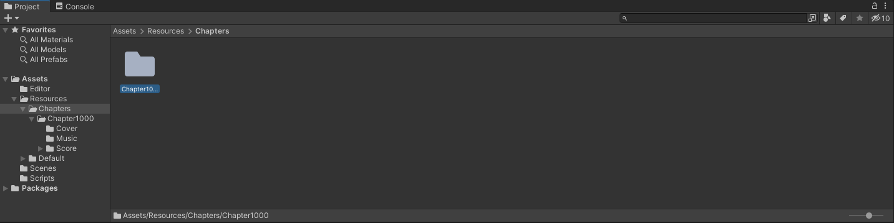
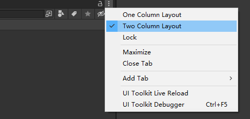
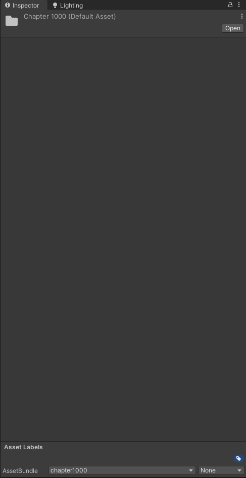
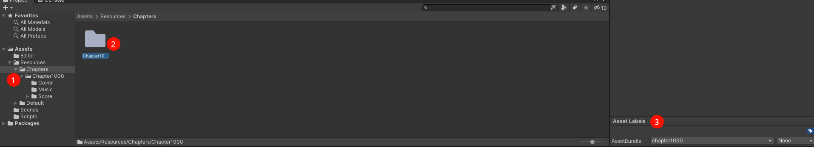

# Resux-OpenSource
音乐游戏《溯 Resux》老玩法（或称为a测玩法）的开源仓库

本项目使用**GPL-3.0**开源协议

## 目录

------

- Client：游戏客户端工程，Unity2021.3.27f1c2
- MapDesigner：游戏制谱器工程，Unity2021.3.27f1c2
- ResourcesBuilder：游戏资源打包工程，Unity2021.3.27f1c2

## 曲、谱、曲绘等资源

------

游戏客户端的Assets/StreamingAsset目录下存放打包好的assetbundle资源包以在运行时使用，资源包按“章节”做区分，而曲绘、章节封面、bgm等资源则在image、audio等包另行存放。

由于曲目授权问题，已有的两个章节内容不提供原资源，仅有资源包保留以便游玩。想要增加歌曲、谱面等只能在新的章节中添加（或者抛弃原有的内容）。

想要增加曲谱等内容，其资源需要在另外的资源打包工程中完成打包后放入客户端对应路径中。如若需要提供部分图片、bgm等资源（不包含溯制作组向其他曲师获取授权的内容）以便后续之作，也可以提issue，溯制作组会尽力提供帮助。

## 如何打包

------

### 客户端打包

------

1. 首先确认各项设置是否有误
   1. 左上角**Edit**->**Project Settings**打开项目设置界面
   2. 选中左侧**Player**页签
   3. 检查**Company Name**（公司名）、**Product Name**（产品/游戏名）、**Version**（版本号）是否有问题，因为不同签名或版本小于已有版本时无法直接覆盖安装
   4. 检查**DefaultIcon**，以及下方ios、安卓等平台的Icon（第一个折叠栏）是否有误
   5. 再往下，检查**Other Settings**中的**PackageName**，即包名，需要与之前版本保持一致，一般无需改动
   6. 检查**Minimum API**（最低兼容的安卓API等级）以及**Target API**（目标安卓API等级），一般无需改动
   7. 最后的**Publish Settings**内有**KeyStore**内容，一般无需改动，如果想要添加，可以点击**KeyStoreManager**自行生成
2. 其次，查看平台是否切换
   1. 左上角**File**->**Build Settings**打开构建界面
   2. 左下角可以切换目标平台，如果没有**切换至安卓或ios**，可以在这里切换。如果尚未安装平台包，也可以点击对应平台并在右侧找到快捷下载按钮
   3. 如果仅是打包游玩，无需修改任何内容，直接点击右下角Build按钮并选择保存包体的路径即可。

### 制谱器打包

------

制谱器仅有windows版本，有mac的或许可以尝试mac版本构建。

直接通过左上角**File**->**Build Settings**打开构建界面，选择windows平台，然后选择**Build**

一般将Build路径选择为**./Build**，即和Assets文件夹同级的Build文件夹。这个文件夹处于.gitignore的范围内，因此其内容不会被识别，从而**避免误提交**。

### 资源打包

------

#### 如何打包资源

不同平台的资源是不同的，需要分别打包。

打开工程后，从**顶部的Assets下拉框**可以在最底部找到两个选项，分别是**Build AssetBundle Android**和**Build AssetBundle iOS**。故名意思，分别是打安卓资源包和iOS资源包的。

打包后生成的是无扩展名的assetbundle资源文件，放入客户端的Assets/StreamingAssets目录下即可。

#### 如何添加资源

**工程中有编辑器工具来自动为章节文件夹生成对应的ab包名**，因此一般来讲无需特意去改，该部分可以略过

这里告诉你**如何添加新的曲、谱以及章节**。

##### 准备部分

- 找到**Project面板**

- 点击右上角的三个点，选择**Two Column**

  

- 找到**Inspector面板**

- 在**Project面板**的**左侧**选中Chapters文件夹，右侧会出现Chapters文件夹下的所有文件和文件夹

- 然后选中**右侧的文件夹**，此时在**Inspector面板的底部**会出现**Asset Labels**面板

  

- 此时在**右侧的Asset Labels中**会出现**AssetBundle**内容，包含两个下拉框，**第一个下拉框**可以选择**已有的包名**或自己点击**new**来**新建一个包名**。第二个无需修改（这里是对拓展名的编辑，如果修改则也要对客户端做修改）

##### 正式添加资源

以上已经了解了如何设置资源包，下面进入正题。

资源内的具体结构在ResourcesBuilder/README.md有介绍。

Chapters下**每一个Chapter文件夹都是一个章节**，所以如果想要添加新的章节，可以新建文件夹并命名（如Chapter123），然后通过上述方式为该文件夹**设置AssetBundle包名**（建议和文件夹名一样，以Chapter+数字命名，以便管理和查找）

将音源、曲绘、谱面等内容添加完毕后，即可通过上述方式进行打包使用了。
